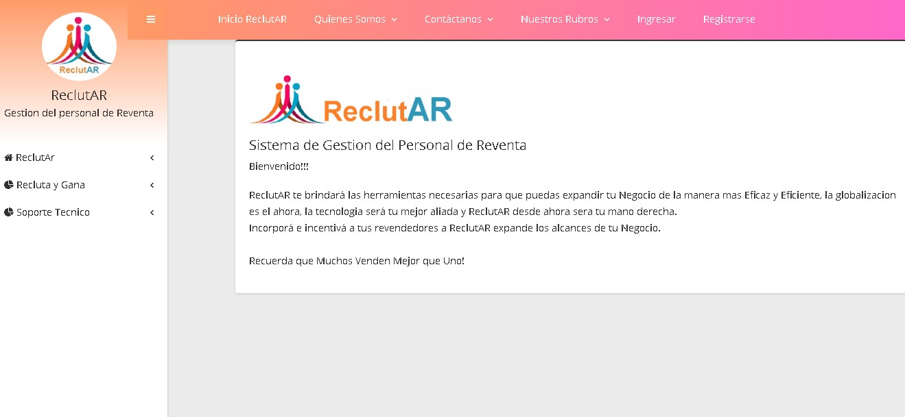

# ReclutAR
**Siatema de Gestión de Personal de Reventa de Productos y Servicios**

***ReclutAR es un sistema pensado para empresas que deseen expandir su Negocio mediante actores "Revendedores" que se dedicarán a la realización de la venta directa al publico por comisiones, comisiones prefijadas por el Administrador tanto para la ganancia del negocio como para sus Revendedores, Expandiendo asi el alcance de su emprendimiento al máximo.***

*ReclutAR esta enfocado en primera instancia a brindar herramientas principalmente a los Actores que ocupen el rol de Administrador, entre estas están darle la posibilidad de:*

- *Crearse un Usuario en ReclutAR*

- *Configurar como llevará a cabo su Negocio desde la Plataforma*

- *Gestionar las Ordenes desde la Plataforma*

- *Listar, hacer filtros y ver estado de Ordenes Recibidas*

- *Ver de las Ordenes cuales Ordenes se convierten efectivamente en Pedidos*

- *Gestionar Pedidos desde la Plataforma*

- *Listar, hacer filtros y ver estado de los Pedidos en la plataforma*

- *ABM Revendedores*

- *ABM de los Productos que Ofrecerá*

- *Listar, hacer filtros y de los Productos cargados*

- *Generar Catalogo.*

***No olvides que  :+1: :+1: :+1: ¡¡ Muchos venden Mejor que uno !!*** :+1: :+1: :+1:

*En segunda Instancia también es beneficiosa para el Revendedor por que contará con las herramientas para ofrecer los productos de la manera más sencilla lo cual le facilitara incrementar sus ingresos, esta contara con* :

- *Podrá realizar Ordenes de Compra mediante la Plataforma*

- *Listar, hacer filtros y ver estado de los Pedidos Realizados en la plataforma*

- *Recibir Bonificaciones por Ingresar nuevos Revendedores*

- *Listar, hacer filtros y ver estado de los Pedidos Realizados en la plataforma*

- *Podrá incorporar nuevos revendedores por medio de la Aplicación con Autorización del Administrador*

- *Contará con un Catalogo para ofrecer los productos de la Empresa*

*Uno de los principales objetivos de Reclutar es poderle brindar puestos de trabajo a personas que carezcan de tiempo, generando asi el habito de remuneracion basandose en la cantidad de esfuerzo invertido en negocio más que la cantidad de horas que pueda estar una persona contratada en un local fisicamente*

***Alentando a que :+1: :+1: :+1: Cuanto mas trabajo inviertas en el negocio, mas sera el incremento de tu ganancia!*** :+1: :+1: :+1: 

